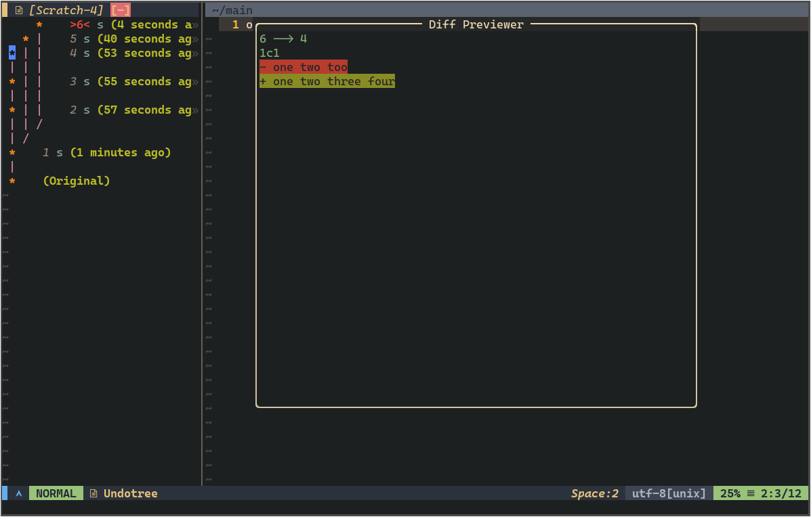

# Undotree

A neovim undotree plugin written in lua.

**Screenshot**



### Requirements

- nvim 0.7.0 or above

### Download and Install

Using Vim's built-in package manager:

```sh
mkdir -p ~/.config/nvim/pack/github/start/
cd ~/.config/nvim/pack/github/start/
git clone https://github.com/nvim-lua/plenary.nvim.git
git clone https://github.com/jiaoshijie/undotree.git
```

Using [vim-plug](https://github.com/junegunn/vim-plug)

```
Plug 'nvim-lua/plenary.nvim'
Plug 'jiaoshijie/undotree'
```

Using [packer.nvim](https://github.com/wbthomason/packer.nvim)

```lua
use {
  "jiaoshijie/undotree",
  requires = {
    "nvim-lua/plenary.nvim",
  },
}
```

### Usage

Basic setup

```lua
require('undotree').setup()
```

If using [packer.nvim](https://github.com/wbthomason/packer.nvim) gitsigns can be setup directly in the plugin spec:

```lua
use {
  "jiaoshijie/undotree",
  config = function()
    require('undotree').setup()
  end,
  requires = {
    "nvim-lua/plenary.nvim",
  },
}
```

Configuration can be passed to the setup function. Here is an example with the default settings:

```lua
local undotree = require('undotree')

undotree.setup({
  float_diff = true,  -- using float window previews diff, set this `true` will disable layout option
  layout = "left_bottom", -- "left_bottom", "left_left_bottom"
  ignore_filetype = { 'Undotree', 'UndotreeDiff', 'qf', 'TelescopePrompt', 'spectre_panel', 'tsplayground' },
  window = {
    winblend = 30,
  },
  keymaps = {
    ['j'] = "move_next",
    ['k'] = "move_prev",
    ['J'] = "move_change_next",
    ['K'] = "move_change_prev",
    ['<cr>'] = "action_enter",
    ['p'] = "enter_diffbuf",
    ['q'] = "quit",
  },
})
```

You can directly use `:lua require('undotree').toggle()` for toggling undotree pannel, or set the following keymaps for convenient using.

```lua
vim.keymap.set('n', '<leader>u', require('undotree').toggle, { noremap = true, silent = ture })

-- or
vim.keymap.set('n', '<leader>uo', require('undotree').open, { noremap = true, silent = ture })
vim.keymap.set('n', '<leader>uc', require('undotree').close, { noremap = true, silent = ture })
```

2. Some Mappings

| Mappings        | Action                                        |
| ----            | ----                                          |
| <kbd>j</kbd>    | jump to next undo node                        |
| <kbd>k</kbd>    | jump to prev undo node                        |
| <kbd>J</kbd>    | jump to next undo node and undo to this state |
| <kbd>K</kbd>    | jump to prev undo node and undo to this state |
| <kbd>q</kbd>    | quit undotree                                 |
| <kbd>p</kbd>    | jump into the undotree diff window            |
| <kbd><cr></kbd> | undo to this state                            |


### License

**MIT**

## Reference

- [how to write a neovim plugin in lua](https://dev.to/2nit/how-to-write-neovim-plugins-in-lua-5cca)
- [undotree](https://github.com/mbbill/undotree)
- [vim-mundo](https://github.com/simnalamburt/vim-mundo)
- [Vim documentation: usr_32](http://vimdoc.sourceforge.net/htmldoc/usr_32.html)
- [how is the undo tree used in vim](https://stackoverflow.com/questions/1088864/how-is-the-undo-tree-used-in-vim)
- [Undo branching and Gundo.vim](http://vimcasts.org/episodes/undo-branching-and-gundo-vim/)
- [Using undo branches](https://vim.fandom.com/wiki/Using_undo_branches)
